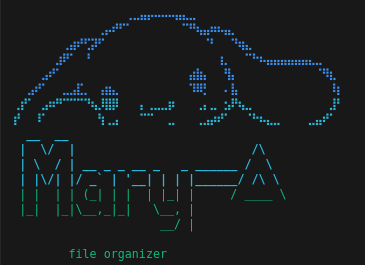

# Mary-A: Organizador de Arquivos


**Mary-A** é uma ferramenta automatizada para organizar seus arquivos de maneira simples e eficiente. Feito em Python, este script move e renomeia arquivos com base em suas extensões, permitindo que você mantenha seu sistema organizado sem esforço.

## Funcionalidades

- Mover arquivos automaticamente para pastas específicas com base em suas extensões (ex: .pdf, .jpg, .mp4, etc).
- Suporte para múltiplas linguagens e formatos de arquivo (ex: SQL, HTML, JavaScript, Python, TypeScript, JSON, etc).
- Renomeia arquivos automaticamente se houver conflitos de nome no diretório de destino.
- Fácil de configurar e personalizar para diferentes categorias de arquivos.

## Requisitos

- Python 3.6+
- Bibliotecas padrão do Python: `shutil`, `os`, `pathlib`, `re`

## Instalação

1. Clone este repositório:

    ```bash
    git clone <link do repositorio>
    ```

2. Navegue até o diretório do projeto:

    ```bash
    cd mary-a
    ```

3. (Opcional) Crie um ambiente virtual e ative-o:

    ```bash
    python3 -m venv venv
    source venv/bin/activate
    ```

## Uso

1. Defina as categorias de arquivos que deseja organizar no arquivo de configuração *data/config.json*:

    Exemplo de categorias:

    ```json
    {
    "path":"pasta raiz onde tudo será organizado",
    [
        { "name": "documents", "regex": "*.pdf|*.docx|*.txt|*.md" },
        { "name": "images", "regex": "*.jpg|*.jpeg|*.png|*.gif" },
        { "name": "videos", "regex": "*.mp4|*.mkv" },
        { "name": "musics", "regex": "*.mp3|*.m4a" },
        { "name": "code", "regex": "*.py|*.js|*.ts|*.html|*.css" }
    ]}
    ```

2. Execute o script:

    ```bash
    python3 main.py
    ```

3. Os arquivos serão automaticamente movidos para suas pastas correspondentes.
